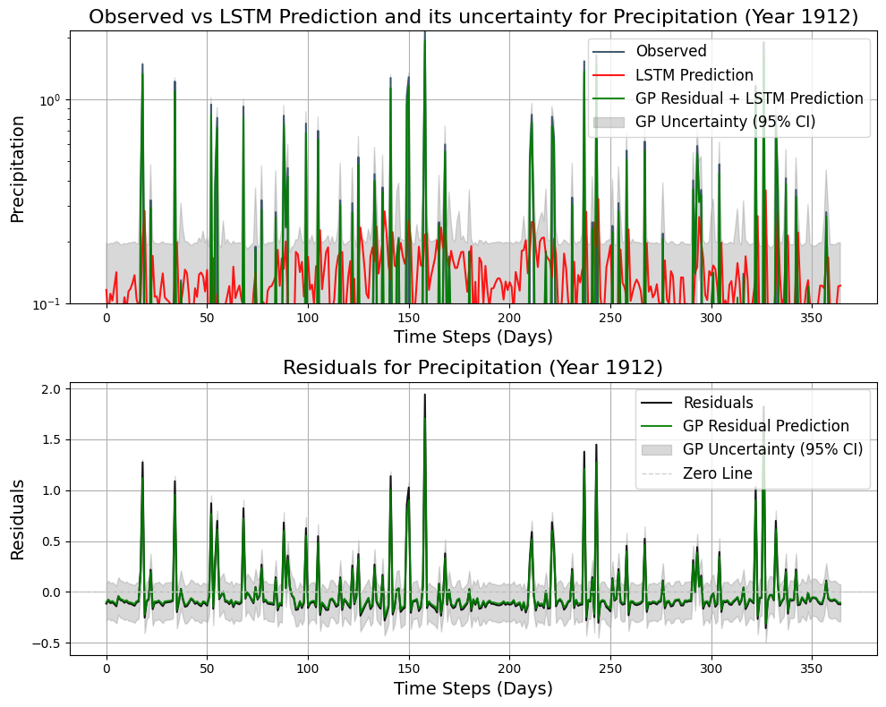

# PPTSA

> **Precipitation Probabilistic Time Series Analysis**  
> Frequency analysis, statistical learning, and uncertainty-aware forecasting of long-term precipitation records.

[](https://jupyter.org)
[](https://www.python.org/)
[](https://www.mathworks.com/)
[](#-license)

---

## 🌧️ Overview

This repository presents a **probabilistic time-series analysis of precipitation**, focusing on the statistical structure, impulse-like behavior, and predictability of rainfall.

Using **140 years of daily precipitation data from Central Park, New York City**, the project combines:

- Frequency-domain analysis  
- Classical stochastic models  
- Point-process formulations  
- Deep learning approaches  
- Probabilistic uncertainty quantification  

The goal is to **understand precipitation dynamics**, assess **forecasting limits**, and **explicitly characterize uncertainty**, particularly in the presence of intermittent and impulsive rainfall events.

---

## 🧾 Results

### 📌 Frequency-Domain Reconstruction (Daily PRCP)

<p align="center" style="margin-bottom: 0;">
  
</p>

<p align="center" style="margin-top: 6px;">
  <em>
    Frequency-domain reconstruction of daily precipitation (PRCP) using the dominant Fourier components (top frequencies).
    Left: original PRCP time series overlaid with the reconstructed signal. Right: reconstruction error (PRCP − reconstructed signal),
    highlighting how impulse-like rainfall events dominate the mismatch.
  </em>
</p>

### 📌 Marked Point Process (MPP): State Estimation (two years)

[Open the PDF figure](Figures/MPP.png)

<p align="center" style="margin-bottom: 0;">
  <a href="Figures/MPP_result.pdf">
    
  </a>
</p>

<p align="center" style="margin-top: 6px;">
  <em>
    MPP state estimation results for two years: (a) the measured precipitation data, (b) the continuous decoded hidden state,
    and (c) the normalized decoded hidden state.
  </em>
</p>

> Note: GitHub may not render PDF figures inline in README. If it doesn’t display above, use the link to open the PDF.


### 📌 LSTM + Gaussian Process (GP): Prediction + Uncertainty (1912)

<p align="center" style="margin-bottom: 0;">
  
</p>

<p align="center" style="margin-top: 6px;">
  <em>
    Observed precipitation values, LSTM predictions, LSTM uncertainty band, Gaussian processes of residuals, and their mean and
    confidence interval for the year 1912.
  </em>
</p>


---

## 🔬 Methods & Modeling Framework

The repository implements and compares the following approaches:

- **Frequency Domain Analysis**  
  Identifies periodicity (or lack thereof) and highlights challenges introduced by impulse-like precipitation patterns.

- **ARIMAX / SARIMAX Models**  
  Captures trends and conditional dependencies using classical time-series models with exogenous variables.

- **Marked Point Process (MPP)**  
  Models precipitation as an impulse-driven stochastic process, offering physical and statistical intuition beyond Gaussian assumptions.

- **LSTM Neural Networks**  
  Learns temporal dependencies among multiple meteorological variables using tuned deep recurrent architectures.

- **Gaussian Process (GP) Residual Modeling**  
  Quantifies predictive uncertainty by modeling LSTM residuals probabilistically.

---

## 📊 Key Findings (High Level)

- Precipitation exhibits **no strong periodicity**, complicating frequency-based forecasting.
- **ARIMAX/SARIMAX** effectively captures long-term trends but struggles with impulses.
- **Marked Point Processes** provide interpretability for impulse-like rainfall events.
- **LSTM models** capture trends but show limited accuracy for exact daily values.
- **Gaussian Processes** accurately model residual uncertainty, improving probabilistic predictions.

---

## 📁 Repository Structure

```text
PPTSA/
├─ Data/
│  └─ Raw and processed meteorological datasets
│
├─ Figures/
│  └─ Generated plots, diagnostics, and visual summaries
│
├─ Models/
│  ├─ Frequency analysis
│  ├─ ARIMAX / SARIMAX models
│  ├─ Marked Point Process formulations
│  ├─ LSTM implementations
│  └─ Gaussian Process residual models
│
├─ Report/
│  └─ PDF/
│     └─ Paper.pdf
│
├─ README.md
└─ LICENSE

```
## 🤝 Contributions

- **Omid Emamjomehzadeh**  
  Conceptualization; finding the dataset and learning how to use it; data preprocessing; methodology development; implementing the LSTM model; hyper-parameter tuning for the LSTM; applying a Gaussian Process to model the residuals of LSTM predictions; analysis and interpretation of results; presentation preparation; writing the original report draft; and editing.

- **Ahmadreza Ahmadjou**  
  Implementing the SARIMAX forecasting model (data processing, training, and parameter tuning via trial-and-error); Marked Point Process (MPP) approach including conceptualization, implementation, and results analysis/interpretation; report writing (writing and editing); and presentation preparation.

- **Ruixuan Zhang**  
  Implementing frequency-domain analysis (DFT and DSTFT); results analysis and visualization; report writing; and presentation preparation.


## 📬 Contact

For questions, feedback, or collaboration opportunities, please email me at:  
[omid.emamjomehzadeh@nyu.edu](mailto:omid.emamjomehzadeh@nyu.edu)

---

## 📚 Citation

If you use this repository in your research or projects, please cite it as follows.

```bibtex
@misc{emamjomehzadeh2024pptsa,
  author       = {Emamjomehzadeh, Omid and Zhang, Ruixuan and Ahmadjou, Ahmadreza},
  title        = {Daily Rainfall Time Series Analysis of Central Park, New York},
  year         = {2024},
  howpublished = {\url{https://github.com/omidemam/PPTSA}},
}


